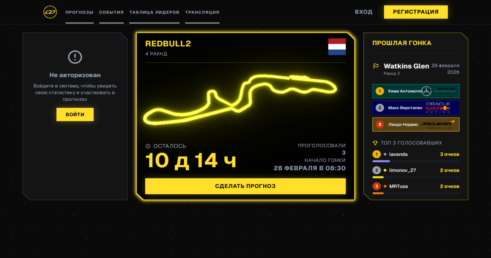

# L27 | Чемпионат прогнозов Формулы 1

[](https://nextjs.org)
[](https://payloadcms.com)
[](https://mongodb.com)
[](https://typescriptlang.org)
[](https://tailwindcss.com)
[](https://threejs.org)

> Сайт с прогнозами по Формуле и таблицей лидеров



**L27** — платформа для прогнозов на гонки Формулы 1. Перед каждым этапом пользователи выбирают тройку призёров, зарабатывают очки за точность и соревнуются в общей таблице чемпионата. Сайт: **[limonov27.ru](https://limonov27.ru)**

---

## Возможности

- **Прогнозы** — выбор подиума (1–3 место) с DND
- **Таблица лидеров** — рейтинг участников с пагинацией и накопленными очками
- **Статистика** — история гонок, серии, процент точных прогнозов, персональные графики
- **Профили** — страница пользователя c обширной статистикой
- **События** — Прогнозы, квизы и многое другое с наградами в виде валюты сайта
- **Трансляция** — Одновременный просмотр трансляции с Твича и ВК (Twitch комментатор/ВК трансляция гонки)
- **CMS** — полное управление данными через Payload CMS (гонки, пилоты, команды, результаты)
- **3D-визуализация** — Трассы на Three.js

---

## Стек

| Frontend | Next.js 15 App Router, React 19, TypeScript |
| Styling | TailwindCSS 4, Geist Font, Radix UI |
| Backend / CMS | Payload CMS 3, Next.js API Routes |
| База данных | MongoDB |
| Хранилище | S3 |
| 3D | Three.js, @react-three/fiber |

---

## Локальный запуск

```bash
git clone https://github.com/your-username/limonov.git
cd limonov
npm install
cp .env.example .env   # заполнить переменные
npm dev
```
